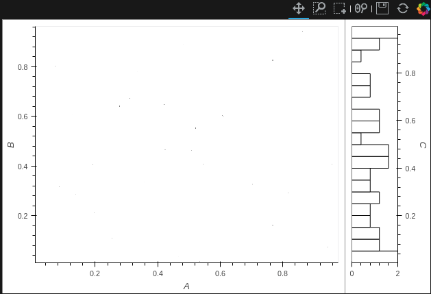
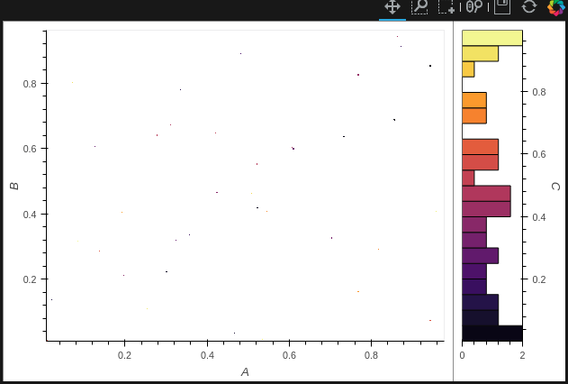

## Selecting data from `Points` 

### Context
You can create `Points` out of a `dataframe`
```python
points = hv.Points(df, kdims=['col_a', 'col_b'])
# kdims are independent variables. 
# Note: `df` has more than just the independent variables.
```

Now we can filter data from this using a `select` query. Here we're selecting values in the range: [`None`, `10.0`]
`points.select(fare_amount=(None, 10.0))`

We can also `select` specific values: `points.select(fare_amount=(11.3))`

## Colormap usage in holoviews-datashader
```python
import pandas as pd
import holoviews as hv
hv.notebook_extension('bokeh')
from holoviews.operation.datashader import rasterize
from datashader.colors import inferno
import numpy as np
df = pd.DataFrame(np.random.randint(0,100,size=(100, 3)), columns=list('ABC'))
points = hv.Points(coords, kdims=['A', 'B'], vdims=['C'])
rasterize(points, aggregator='mean').hist().options('Image', width=500, height=400, cmap=inferno)
```

Running this in a notebook would render something like this 

We need to use: 
`from matplotlib.cm import inferno #or from bokeh.palettes import Inferno256 as inferno` instead of `from datashader.colors import inferno` to fix then and get output like this: 

The problem is the format in which the colormap is stored:
```python
from datashader.colors import inferno as ds_inferno
from matplotlib.cm import inferno as mpl_inferno
from bokeh.palettes import Inferno256 as bokeh_inferno
print(ds_inferno[0], mpl_inferno, bokeh_inferno[0])

(0, 0, 3) <matplotlib.colors.ListedColormap object at 0x7f5b18d1dc18> #000003
```

Thanks @jbednar
